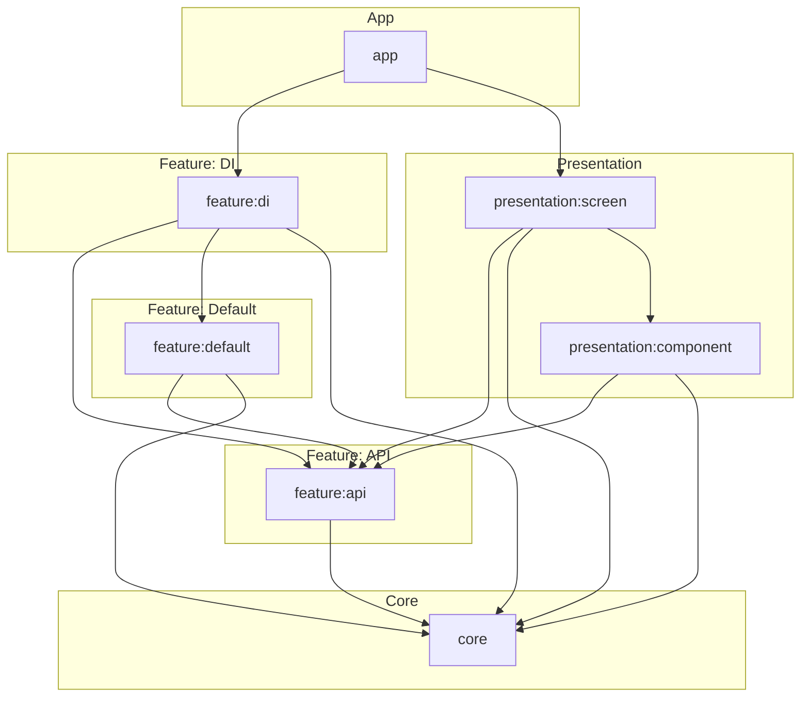

 

# Scrooge 🐷💰

**Scrooge** is an Android application designed to help you **track your incomes, expenses, and
financial flow** with clarity and efficiency.

---

## Architecture 🏗️

Modules are divided into:

- **Core** — shared resources, database, entities, utilities, and design system.
- **Feature** — domain-specific functionality (category, currency, transaction, reports, tags,
  themes, etc.).
- **Presentation** — screens and reusable UI components.

