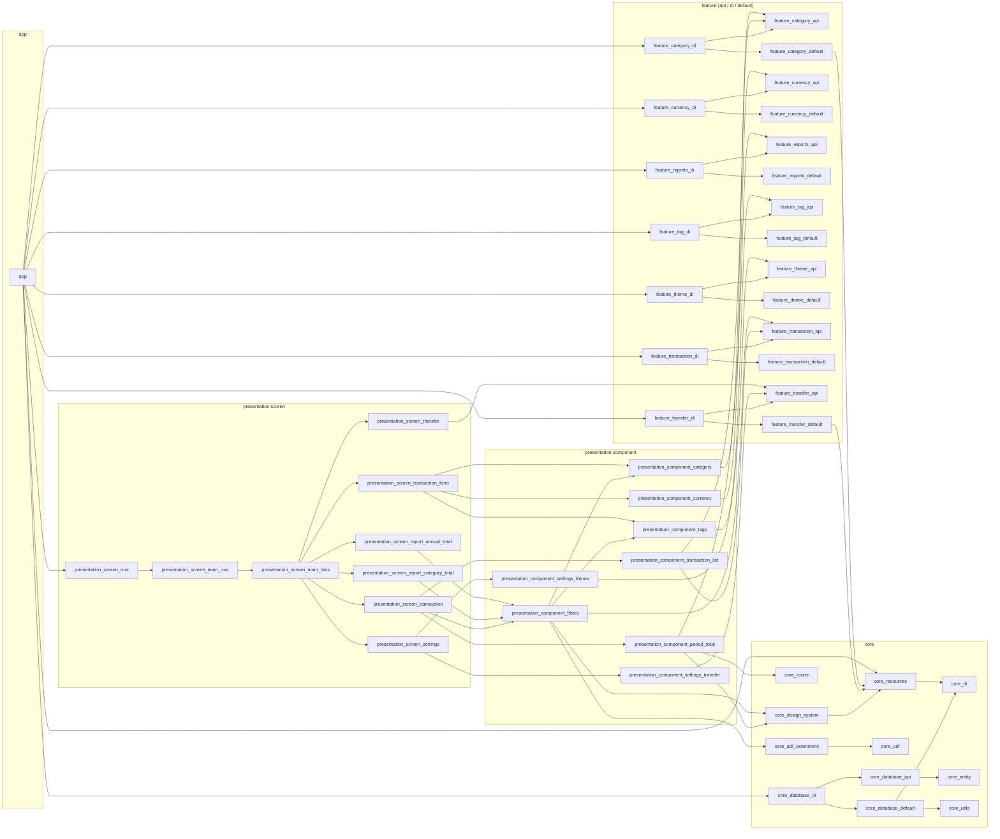

## Module Dependency Graph

```mermaid
graph LR

%% ===== COLUMN 1: APP =====
subgraph APP["app"]
    app
end

%% ===== COLUMN 2: PRESENTATION SCREENS =====
subgraph PRES_SCREEN["presentation:screen"]
    presentation_screen_root
    presentation_screen_main_root
    presentation_screen_main_tabs
    presentation_screen_report_annual_total
    presentation_screen_report_category_total
    presentation_screen_settings
    presentation_screen_transaction
    presentation_screen_transaction_form
    presentation_screen_transfer
end

%% ===== COLUMN 3: PRESENTATION COMPONENTS =====
subgraph PRES_COMPONENT["presentation:component"]
    presentation_component_filters
    presentation_component_category
    presentation_component_currency
    presentation_component_tags
    presentation_component_period_total
    presentation_component_settings_theme
    presentation_component_settings_transfer
    presentation_component_transaction_list
end

%% ===== COLUMN 4: FEATURE =====
subgraph FEATURE["feature (api / di / default)"]
    feature_category_api
    feature_category_di
    feature_category_default

    feature_currency_api
    feature_currency_di
    feature_currency_default

    feature_reports_api
    feature_reports_di
    feature_reports_default

    feature_tag_api
    feature_tag_di
    feature_tag_default

    feature_theme_api
    feature_theme_di
    feature_theme_default

    feature_transaction_api
    feature_transaction_di
    feature_transaction_default

    feature_transfer_api
    feature_transfer_di
    feature_transfer_default
end

%% ===== COLUMN 5: CORE =====
subgraph CORE["core"]
    core_design_system
    core_resources
    core_di
    core_router
    core_entity
    core_utils
    core_udf_extensions
    core_udf
    core_database_api
    core_database_di
    core_database_default
end

%% ===================
%%       EDGES
%% ===================

%% --- app deps ---
app --> presentation_screen_root
app --> core_database_di
app --> core_resources
app --> feature_category_di
app --> feature_currency_di
app --> feature_reports_di
app --> feature_tag_di
app --> feature_theme_di
app --> feature_transaction_di
app --> feature_transfer_di

%% --- presentation screen deps ---
presentation_screen_root --> presentation_screen_main_root
presentation_screen_main_root --> presentation_screen_main_tabs

presentation_screen_main_tabs --> presentation_screen_report_annual_total
presentation_screen_main_tabs --> presentation_screen_report_category_total
presentation_screen_main_tabs --> presentation_screen_settings
presentation_screen_main_tabs --> presentation_screen_transaction
presentation_screen_main_tabs --> presentation_screen_transaction_form
presentation_screen_main_tabs --> presentation_screen_transfer

presentation_screen_report_annual_total --> presentation_component_filters
presentation_screen_report_category_total --> presentation_component_filters

presentation_screen_settings --> presentation_component_settings_theme
presentation_screen_settings --> presentation_component_settings_transfer

presentation_screen_transaction --> presentation_component_filters
presentation_screen_transaction --> presentation_component_period_total
presentation_screen_transaction --> presentation_component_transaction_list

presentation_screen_transaction_form --> presentation_component_category
presentation_screen_transaction_form --> presentation_component_currency
presentation_screen_transaction_form --> presentation_component_tags

presentation_screen_transfer --> feature_transfer_api

%% --- component deps ---
presentation_component_filters --> core_design_system
presentation_component_filters --> core_udf_extensions
presentation_component_filters --> feature_transaction_api
presentation_component_filters --> presentation_component_category
presentation_component_filters --> presentation_component_tags

presentation_component_category --> feature_category_api
presentation_component_tags --> feature_tag_api

presentation_component_currency --> feature_currency_api

presentation_component_period_total --> core_design_system
presentation_component_period_total --> core_router
presentation_component_period_total --> feature_reports_api

presentation_component_settings_theme --> feature_theme_api
presentation_component_settings_transfer --> feature_transfer_api

presentation_component_transaction_list --> feature_category_api
presentation_component_transaction_list --> feature_transaction_api

%% --- feature deps ---
feature_category_di --> feature_category_api
feature_category_di --> feature_category_default
feature_category_default --> core_resources

feature_currency_di --> feature_currency_api
feature_currency_di --> feature_currency_default

feature_reports_di --> feature_reports_api
feature_reports_di --> feature_reports_default

feature_tag_di --> feature_tag_api
feature_tag_di --> feature_tag_default

feature_theme_di --> feature_theme_api
feature_theme_di --> feature_theme_default

feature_transaction_di --> feature_transaction_api
feature_transaction_di --> feature_transaction_default

feature_transfer_di --> feature_transfer_api
feature_transfer_di --> feature_transfer_default
feature_transfer_default --> core_resources

%% --- core deps ---
core_design_system --> core_resources
core_resources --> core_di
core_udf_extensions --> core_udf

core_database_di --> core_database_api
core_database_api --> core_entity
core_database_di --> core_database_default
core_database_default --> core_utils
core_database_default --> core_di
```