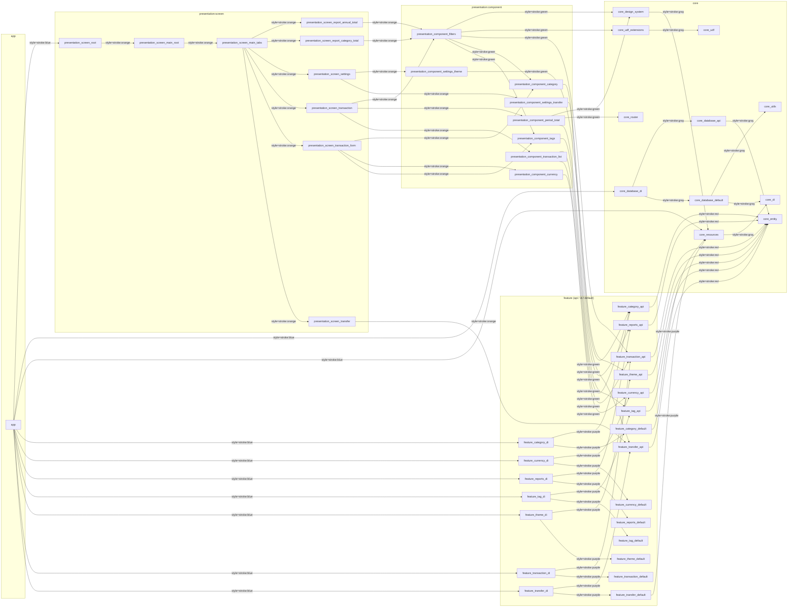

## Module Dependency Graph

```mermaid
graph LR

%% ===== COLUMN 1: APP =====
    subgraph APP["app"]
        app
    end

%% ===== COLUMN 2: PRESENTATION SCREENS =====
    subgraph PRES_SCREEN["presentation:screen"]
        presentation_screen_root
        presentation_screen_main_root
        presentation_screen_main_tabs
        presentation_screen_report_annual_total
        presentation_screen_report_category_total
        presentation_screen_settings
        presentation_screen_transaction
        presentation_screen_transaction_form
        presentation_screen_transfer
    end

%% ===== COLUMN 3: PRESENTATION COMPONENTS =====
    subgraph PRES_COMPONENT["presentation:component"]
        presentation_component_filters
        presentation_component_category
        presentation_component_currency
        presentation_component_tags
        presentation_component_period_total
        presentation_component_settings_theme
        presentation_component_settings_transfer
        presentation_component_transaction_list
    end

%% ===== COLUMN 4: FEATURE =====
    subgraph FEATURE["feature (api / di / default)"]
        feature_category_api
        feature_category_di
        feature_category_default

        feature_currency_api
        feature_currency_di
        feature_currency_default

        feature_reports_api
        feature_reports_di
        feature_reports_default

        feature_tag_api
        feature_tag_di
        feature_tag_default

        feature_theme_api
        feature_theme_di
        feature_theme_default

        feature_transaction_api
        feature_transaction_di
        feature_transaction_default

        feature_transfer_api
        feature_transfer_di
        feature_transfer_default
    end

%% ===== COLUMN 5: CORE =====
    subgraph CORE["core"]
        core_design_system
        core_resources
        core_di
        core_router
        core_entity
        core_utils
        core_udf_extensions
        core_udf
        core_database_api
        core_database_di
        core_database_default
    end

%% ===================
%%       EDGES
%% ===================

%% --- app deps (blue) ---
    app -->|style=stroke:blue| presentation_screen_root
    app -->|style=stroke:blue| core_database_di
    app -->|style=stroke:blue| core_resources
    app -->|style=stroke:blue| feature_category_di
    app -->|style=stroke:blue| feature_currency_di
    app -->|style=stroke:blue| feature_reports_di
    app -->|style=stroke:blue| feature_tag_di
    app -->|style=stroke:blue| feature_theme_di
    app -->|style=stroke:blue| feature_transaction_di
    app -->|style=stroke:blue| feature_transfer_di

%% --- presentation screen deps (orange) ---
    presentation_screen_root -->|style=stroke:orange| presentation_screen_main_root
    presentation_screen_main_root -->|style=stroke:orange| presentation_screen_main_tabs

    presentation_screen_main_tabs -->|style=stroke:orange| presentation_screen_report_annual_total
    presentation_screen_main_tabs -->|style=stroke:orange| presentation_screen_report_category_total
    presentation_screen_main_tabs -->|style=stroke:orange| presentation_screen_settings
    presentation_screen_main_tabs -->|style=stroke:orange| presentation_screen_transaction
    presentation_screen_main_tabs -->|style=stroke:orange| presentation_screen_transaction_form
    presentation_screen_main_tabs -->|style=stroke:orange| presentation_screen_transfer

    presentation_screen_report_annual_total -->|style=stroke:orange| presentation_component_filters
    presentation_screen_report_category_total -->|style=stroke:orange| presentation_component_filters

    presentation_screen_settings -->|style=stroke:orange| presentation_component_settings_theme
    presentation_screen_settings -->|style=stroke:orange| presentation_component_settings_transfer

    presentation_screen_transaction -->|style=stroke:orange| presentation_component_filters
    presentation_screen_transaction -->|style=stroke:orange| presentation_component_period_total
    presentation_screen_transaction -->|style=stroke:orange| presentation_component_transaction_list

    presentation_screen_transaction_form -->|style=stroke:orange| presentation_component_category
    presentation_screen_transaction_form -->|style=stroke:orange| presentation_component_currency
    presentation_screen_transaction_form -->|style=stroke:orange| presentation_component_tags

    presentation_screen_transfer -->|style=stroke:orange| feature_transfer_api

%% --- component deps (green) ---
    presentation_component_filters -->|style=stroke:green| core_design_system
    presentation_component_filters -->|style=stroke:green| core_udf_extensions
    presentation_component_filters -->|style=stroke:green| feature_transaction_api
    presentation_component_filters -->|style=stroke:green| presentation_component_category
    presentation_component_filters -->|style=stroke:green| presentation_component_tags

    presentation_component_category -->|style=stroke:green| feature_category_api
    presentation_component_tags -->|style=stroke:green| feature_tag_api

    presentation_component_currency -->|style=stroke:green| feature_currency_api

    presentation_component_period_total -->|style=stroke:green| core_design_system
    presentation_component_period_total -->|style=stroke:green| core_router
    presentation_component_period_total -->|style=stroke:green| feature_reports_api

    presentation_component_settings_theme -->|style=stroke:green| feature_theme_api
    presentation_component_settings_transfer -->|style=stroke:green| feature_transfer_api

    presentation_component_transaction_list -->|style=stroke:green| feature_category_api
    presentation_component_transaction_list -->|style=stroke:green| feature_transaction_api

%% --- feature deps (purple) ---
    feature_category_di -->|style=stroke:purple| feature_category_api
    feature_category_di -->|style=stroke:purple| feature_category_default
    feature_category_default -->|style=stroke:purple| core_resources

    feature_currency_di -->|style=stroke:purple| feature_currency_api
    feature_currency_di -->|style=stroke:purple| feature_currency_default

    feature_reports_di -->|style=stroke:purple| feature_reports_api
    feature_reports_di -->|style=stroke:purple| feature_reports_default

    feature_tag_di -->|style=stroke:purple| feature_tag_api
    feature_tag_di -->|style=stroke:purple| feature_tag_default

    feature_theme_di -->|style=stroke:purple| feature_theme_api
    feature_theme_di -->|style=stroke:purple| feature_theme_default

    feature_transaction_di -->|style=stroke:purple| feature_transaction_api
    feature_transaction_di -->|style=stroke:purple| feature_transaction_default

    feature_transfer_di -->|style=stroke:purple| feature_transfer_api
    feature_transfer_di -->|style=stroke:purple| feature_transfer_default
    feature_transfer_default -->|style=stroke:purple| core_resources

%% --- core deps (gray) ---
    core_design_system -->|style=stroke:gray| core_resources
    core_resources -->|style=stroke:gray| core_di
    core_udf_extensions -->|style=stroke:gray| core_udf

    core_database_di -->|style=stroke:gray| core_database_api
    core_database_api -->|style=stroke:gray| core_entity
    core_database_di -->|style=stroke:gray| core_database_default
    core_database_default -->|style=stroke:gray| core_utils
    core_database_default -->|style=stroke:gray| core_di

%% --- ALL *_API depend on core_entity (red) ---
    feature_category_api -->|style=stroke:red| core_entity
    feature_currency_api -->|style=stroke:red| core_entity
    feature_reports_api -->|style=stroke:red| core_entity
    feature_tag_api -->|style=stroke:red| core_entity
    feature_theme_api -->|style=stroke:red| core_entity
    feature_transaction_api -->|style=stroke:red| core_entity
    feature_transfer_api -->|style=stroke:red| core_entity
```